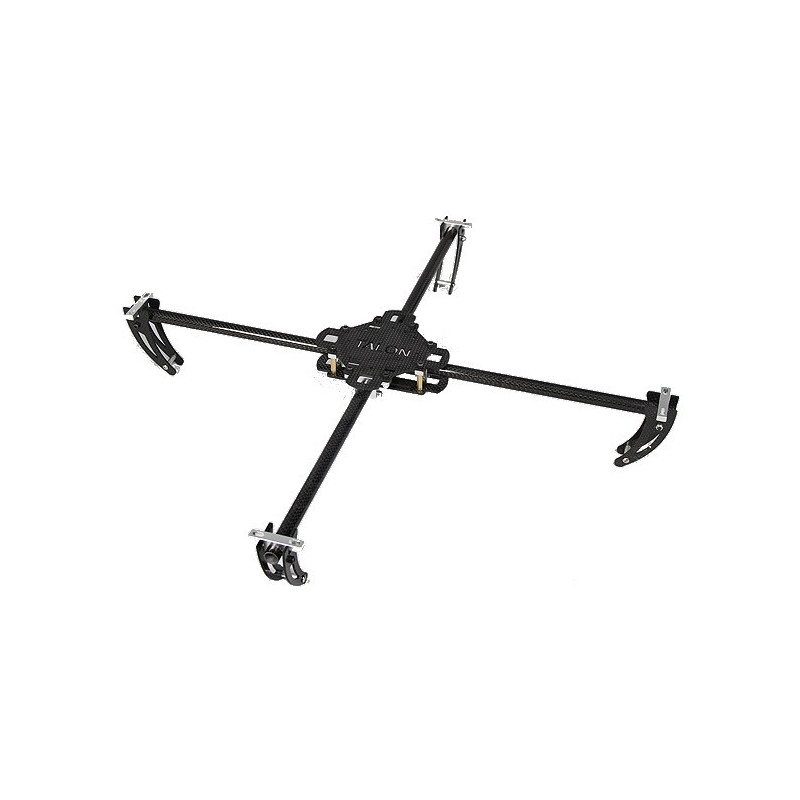

# CASE Quadcopter - Turningy Talon

## The Quadcopter project
A CASE Association project meant for any member to take on.
the plan so far is to
- Reassemble
- Test
- Plan for future project

## Turningy Tallon
#### OBS not assembled

## System overview

## How do you use it?

## How does it work?

## Development

## Contributors

## License

Distributed under the MIT license. See ``LICENSE`` for more information.